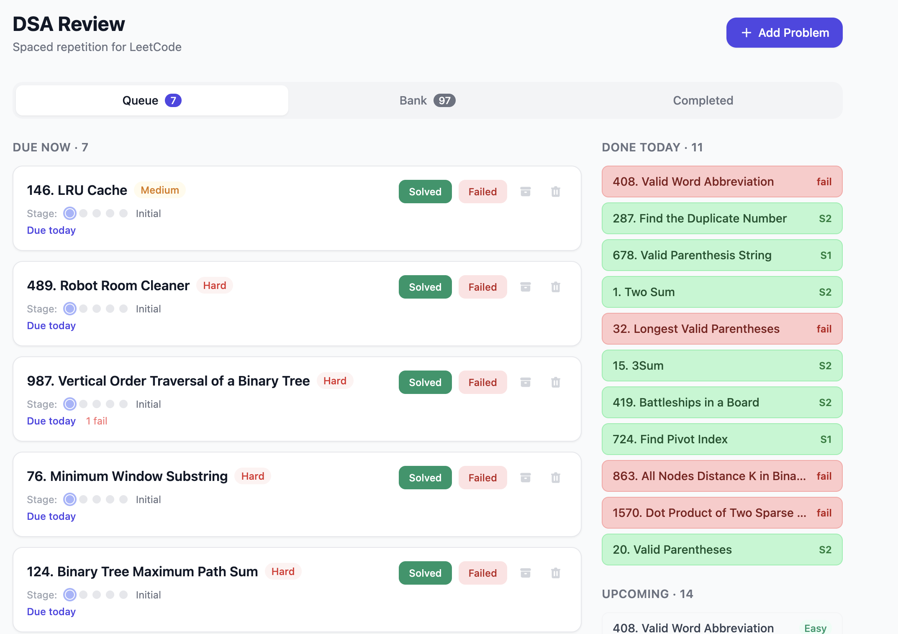

# DSA Prep

A personal spaced repetition dashboard for studying LeetCode problems. Built with React + TypeScript + Tailwind CSS. No backend — all data lives in your browser's `localStorage`.



## Features

- **Spaced repetition scheduling** — problems follow a 5-stage review cycle (1 → 3 → 7 → 14 days)
- **Queue ranking** — in-progress problems surface before untouched ones, sorted by most overdue
- **Bulk import** — paste a list of LeetCode problem numbers/titles and import them all at once
- **Done Today tracker** — see what you solved or failed in the current session
- **Upcoming sidebar** — preview what's coming up in the next few days
- **Fail counter** — tracks how many times you've failed each problem

## Spaced Repetition Stages

| Stage | Interval after solving |
|-------|----------------------|
| 0 → 1 | +1 day |
| 1 → 2 | +3 days |
| 2 → 3 | +7 days |
| 3 → 4 | +14 days |
| 4     | Completed |

Failing a problem keeps you on the same stage and reschedules it for tomorrow.

## Getting Started

```bash
git clone https://github.com/YOUR_USERNAME/dsa-prep.git
cd dsa-prep
npm install
npm run dev
```

Open [http://localhost:5173](http://localhost:5173).

## Bulk Import Format

One problem per line. Supports optional difficulty tags:

```
1. Two Sum
704. Binary Search (Easy)
76. Minimum Window Substring Hard
```

LeetCode URLs are auto-generated from the problem title.

## Tech Stack

- [React 18](https://react.dev/)
- [TypeScript](https://www.typescriptlang.org/)
- [Vite](https://vitejs.dev/)
- [Tailwind CSS](https://tailwindcss.com/)

## Data

All data is stored in `localStorage` under the key `dsa-prep-problems`. No accounts, no server, no tracking.
